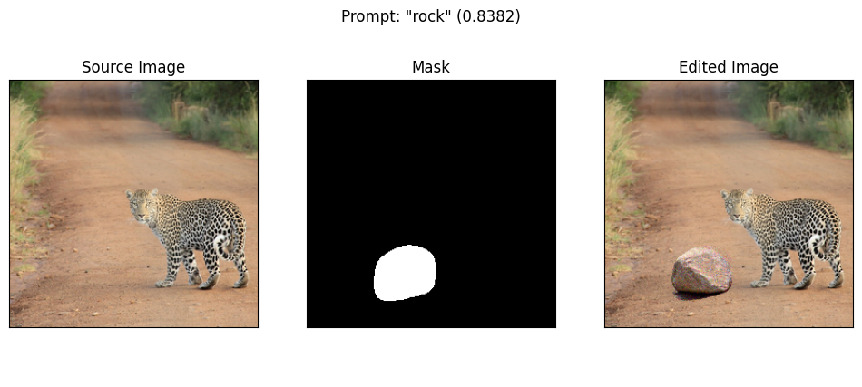
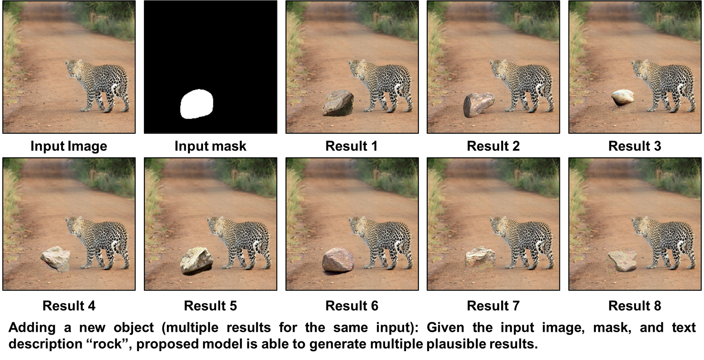
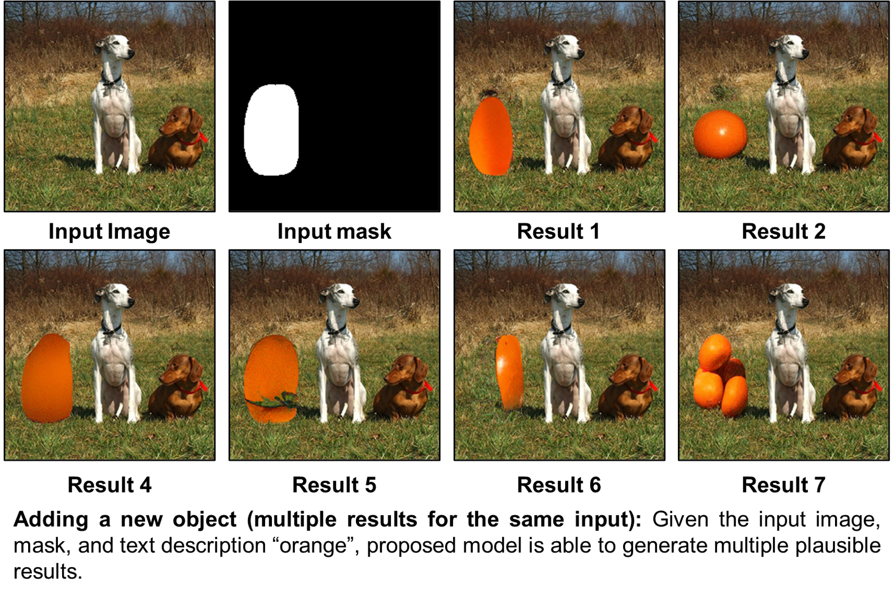
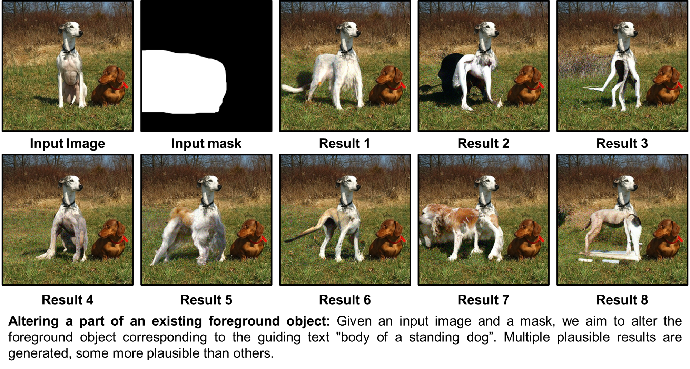
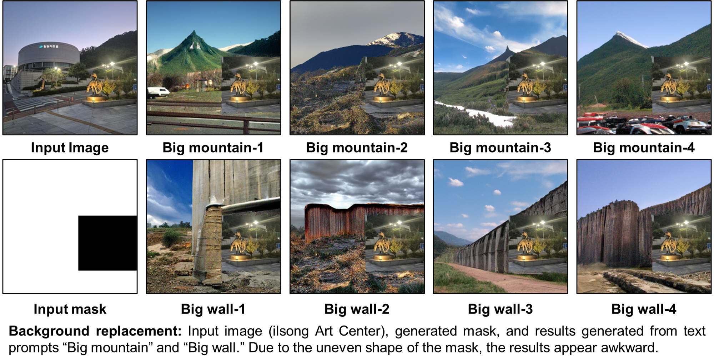

# Blended Diffusion for Text-driven Editing of Natural Images [CVPR 2022]

<a href="https://omriavrahami.com/blended-diffusion-page/"></a> 
<a href="https://arxiv.org/abs/2111.14818"></a>
[](https://github.com/omriav/blended-diffusion)

# 📌 Notice

This repository was created solely for educational and non-commercial purposes as part of a course assignment.  
All rights and intellectual property belong to the original authors of the referenced work:  
[Blended Diffusion for Text-driven Editing of Natural Images](https://github.com/omriav/blended-diffusion/tree/master)
>
> <a href="https://omriavrahami.com/blended-diffusion-page/">**Blended Diffusion for Text-driven Editing of Natural Images**</a>
>
> Omri Avrahami, Dani Lischinski, Ohad Fried
>
> Abstract: Natural language offers a highly intuitive interface for image editing. In this paper, we introduce the first solution for performing local (region-based) edits in generic natural images, based on a natural language description along with an ROI mask.
We achieve our goal by leveraging and combining a pretrained language-image model (CLIP), to steer the edit towards a user-provided text prompt, with a denoising diffusion probabilistic model (DDPM) to generate natural-looking results.
To seamlessly fuse the edited region with the unchanged parts of the image, we spatially blend noised versions of the input image with the local text-guided diffusion latent at a progression of noise levels.
In addition, we show that adding augmentations to the diffusion process mitigates adversarial results.
We compare against several baselines and related methods, both qualitatively and quantitatively, and show that our method outperforms these solutions in terms of overall realism, ability to preserve the background and matching the text. Finally, we show several text-driven editing applications, including adding a new object to an image, removing/replacing/altering existing objects, background replacement, and image extrapolation.

# Getting Started
## Installation
1. Create the virtual environment:

```bash
conda create --name blended-diffusion python=3.9
conda activate blended-diffusion
pip3 install ftfy regex matplotlib lpips kornia opencv-python torch==1.9.0+cu111 torchvision==0.10.0+cu111 -f https://download.pytorch.org/whl/torch_stable.html
```
* If you encounter a Numpy-related error, change the version to 1.26.4.
```bash
pip3 install "numpy<2.0"
```
2. Create a `checkpoints` directory and download the pretrained diffusion model from [here](https://huggingface.co/omriav/blended-diffusion/resolve/main/checkpoints/256x256_diffusion_uncond.pt?download=true) to this folder.

# Image Generation
An exaple of text-driven multiple synthesis results:

```bash
python main.py -p "rock" -i "input_example/img.png" --mask "input_example/mask.png" --output_path "output"
```
The generation results will be saved in `output/rancked` folder, ordered by CLIP similarity rank. In order to get the best results, please generate a large number of results (at least 64)and take the best ones.
>
In order to generate multiple results in a single diffusion process, we utilized batch processing. If you get `CUDA out of memory` try first to lower the batch size by setting `--batch_size 1`.




# Applications

### Multiple synthesis results for the same prompt



### Altering part of an existing object


### Background replacement


# Acknowledgments
This code borrows from [CLIP](https://github.com/openai/CLIP), [Guided-diffusion](https://github.com/openai/guided-diffusion) and [CLIP-Guided Diffusion](https://colab.research.google.com/drive/12a_Wrfi2_gwwAuN3VvMTwVMz9TfqctNj).
